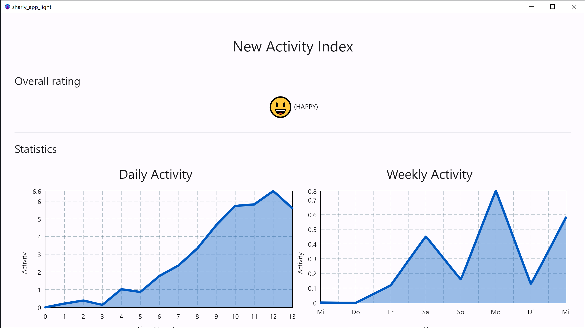
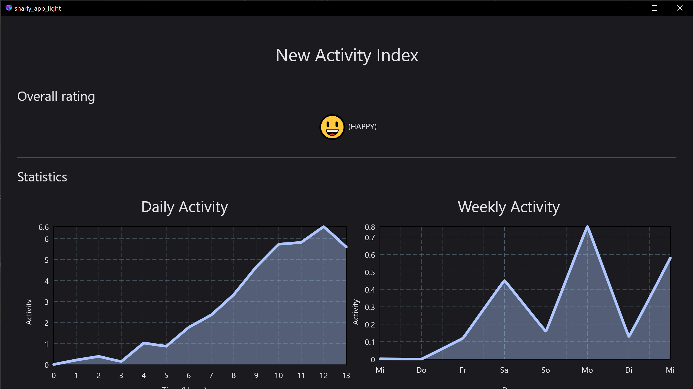

# App (sharly-light)

A multiplatform application for viewing the activity of the SHARLY system.

## Table of contents
* [Screenshots](#screenshots)
* [Getting started](#getting-started)
    * [Manual installation](#manual-installation)
    * [Windows](#windows-7-or-higher)
    * [Android](#android)
    * [Linux](#linux)
    * [Web](#web)
    * [iOS & macOS](#ios--macos)

## Screenshots
|  |  |
|:---------------------------------------------------:|:-------------------------------------------------:|
|                     Light mode                      |                     Dark mode                     |

## Usage
When opening the app, the user can see the latest activity index and statistics about the
recent activity.

If a new activity index is available the user will be notified via a push notification.

## Getting started

### Manual installation
1. Use `git clone https://github.com/jbaudisch/sharly-light.git` to clone this repository.

2. Download [Flutter](https://flutter.dev/) and make sure `flutter/bin` is added to your `PATH`.

#### Windows 7 or higher
3. Run `flutter build windows --release` to build the project or `flutter run --release` and select windows to build
   and run the project. The build output is located in `build/windows/runner/Release`.

#### Build a Windows installer
3. Execute `dart run msix:create` to create a Windows installer. The installer will be located in `build/windows/msix`.

#### Android
3. Run `flutter build apk --release` to build the project or `flutter run --release` and select a connected
   Android device to build and run the project. The build output is located in `build/app/outputs/flutter-apk`.

#### Linux
3. Run `flutter run --release` and select linux if prompted to run the project.

#### Web
3. Run `flutter run --release` and select web if prompted to run the project.

#### iOS & macOS
Currently, support for iOS and macOS is completely untested.

### Configuration
To configure the app, edit the values in the `lib/config.dart` file.